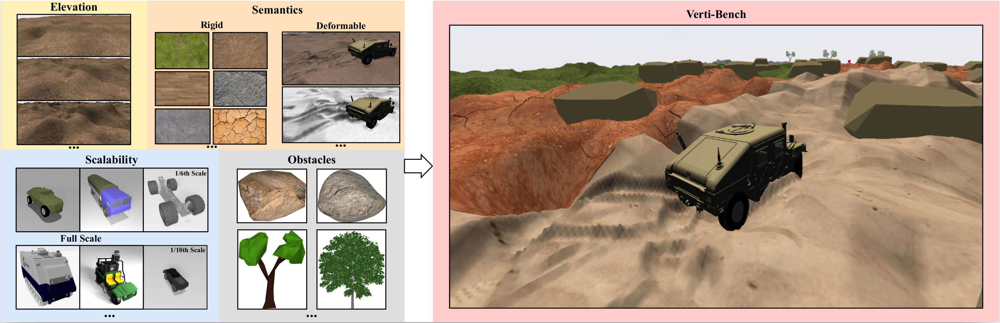
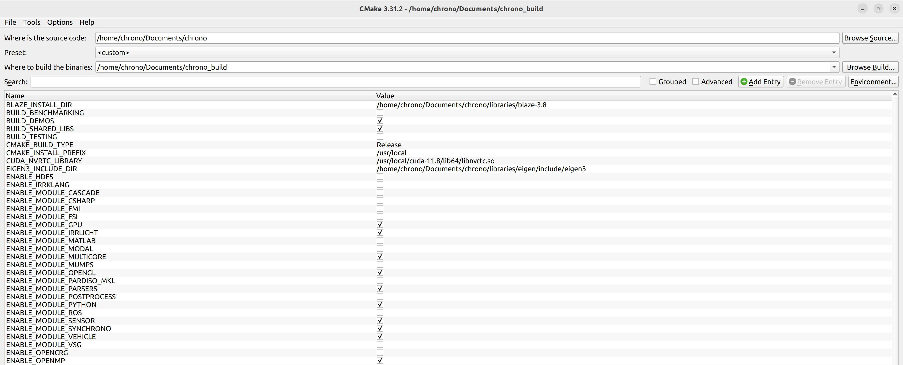
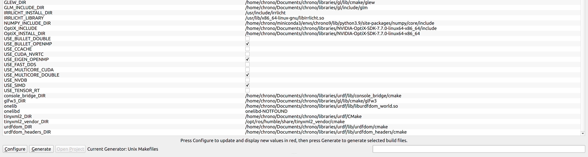

<h1 align="center">
Verti-Bench: A General and Scalable Off-Road Mobility Benchmark for Vertically Challenging Terrain 
</h1>

<div align="center">

Robotics: Science and Systems (RSS) 2025

[[Website]](https://cs.gmu.edu/~xiao/Research/Verti-Bench/)
[[Arxiv]](https://arxiv.org/pdf/2502.11426)
[[Video]](https://www.youtube.com/watch?v=O9VlMg3tnvo)

<p align="center">
  
  &nbsp;&nbsp;&nbsp;&nbsp;&nbsp;
  
</p>


[](https://projectchrono.org/) [](https://ubuntu.com/blog/tag/22-04-lts) []()

<p align="center">
    
</p>

</div>

### TODO
- [x] Release code pipeline
- [x] Release ten off-road mobility systems
- [x] Release different scale vehicles
- [x] Release manual controller by Logitech G29 Driving Force Racing Wheel and Floor Pedals
- [x] Release semantic maps for each world
- [ ] Release datasets from expert demonstration, random exploration, failure cases

# Introduction
Verti-Bench, a general and scalable off-road mobility benchmark that focuses on extremely rugged, vertically challenging terrain with a variety of unstructured off-road features. The main goal of Verti-Bench is to directly compare the performances of different off-road mobility systems. Based on a high-fidelity multi-physics
dynamics simulator, [Chrono](https://projectchrono.org/), Verti-Bench encapsulates variations in four orthogonal dimensions: elevation, semantics, vehicle scalability and obstacles.

# Installation
There are two options for installing PyChrono on your computer. The first one uses a prebuilt conda packages only working for hmmwv vehicle (which is adapted from [official PyChrono installation](https://api.projectchrono.org/pychrono_installation.html) and [gym-chrono](https://github.com/projectchrono/gym-chrono)). The second one is for users who need to build the full library from the C++ source and is the recommended way for nine types vehicle.

### Dependencies:
> Ubuntu 22.04 or above.

> ROS2 Humble.

> Miniconda for Linux.

> Only NVIDIA CUDA driver & Toolkit 11.8 for `Chrono::sensor` module and RL training (use `nvcc --version` & `nvidia-smi` to test installation).

### A) Pychrono 9.0.1 from Conda 
1. Add the `conda-forge` channel to the list of channels:
```
conda config --add channels https://conda.anaconda.org/conda-forge
```
2. Create a `chrono9` environment with Python 3.9:
```
conda create -n chrono9 python=3.9
```
Then activate that environment:
```
conda activate chrono9
```
so that all subsequent conda commands occur within that environment.

3. Install the necessary dependencies:

**Attention**: Install the following packages using the versions specified below, in the order given, and before installing the `PyChrono` conda package itself, which is done in a subsequent step!

- Installing gymnasium
```
pip install gymnasium
```

- Installing stable-baselines3
```
pip install stable-baselines3[extra] 
```
> [!NOTE]
> `stable-baselines3` installs nupmy as a dependency, so it is recomended to remove this installation and install your own version of numpy. Additionally, `pychrono` requires `numpy=1.24.0`, and it must be installed with conda as below.

- Intel MKL package (required for PyChrono demos using the Pardiso direct sparse linear solver, for Numpy, and for PythonOCC)
```
conda install -c conda-forge mkl=2020
```

- Numpy related package (required for the `Chrono::Sensor` module)
```
pip uninstall numpy
conda install -c conda-forge numpy=1.24.0
pip3 install torch torchvision torchaudio --index-url https://download.pytorch.org/whl/cu118
pip install pyyaml scipy
pip install evdev
```

- Irrlicht, for run-time visualization
```
conda install -c conda-forge irrlicht=1.8.5
```

- Pythonocc-core, for `Chrono::Cascade` support
```
conda install -c conda-forge pythonocc-core=7.4.1
```

- Gnuplot, for graphing data
```
conda install conda-forge::gnuplot
```

- For `Chrono::Sensor` support, install GLFW
```
conda install -c conda-forge glfw
```

4. Install the `PyChrono 9.0.1` conda package from [here](https://drive.google.com/file/d/1bEiBawKRFip1th70EcP5w6Hr-nh6rXMP/view?usp=sharing) in the google drive:
```
conda install pychrono-9.0.1-py39_1.tar.bz2
```

5. After cloning this codebase (assuming you cloned this repo to `~/Documents/verti_bench/`; adjust the path below if you cloned it elsewhere), add Verti-Bench data directory to `.bashrc`:
```
echo 'export CHRONO_DATA_DIR=$HOME/Documents/verti_bench/envs/data/' >> ~/.bashrc
echo 'export PYTHONPATH=$PYTHONPATH:$HOME/Documents/' >> ~/.bashrc
```

6. Install ros2 humble related pkgs for systems
```
sudo apt install ros-humble-grid-map-msgs ros-humble-geometry-msgs
```

7. Download the large files managed by Git Large File Storage (Git LFS)
```
sudo apt update
sudo apt install git-lfs
```
Then from folder `~/Documents/verti_bench/`:
```
git lfs install
git lfs pull
```

### B) Pychrono 9.0.1 from Source
1. Clone the 901 branch from [here](https://github.com/madhan001/chrono/tree/901) (assuming you cloned `chrono` repo to `<YOUR_HOME_DIR>/Documents/chrono`) and update the submodule:
```
git clone -b 901 https://github.com/madhan001/chrono.git
cd chrono
git submodule update --init --recursive
```
2. Install the build dependencies:
- Install `cmake-gui`
```
sudo snap install cmake --classic
```
- Install `swig`: make sure `swig` version is above 4.0 and use `swig -version` to test installation
```
sudo apt update
sudo apt install swig
```
- Install necessary `gcc` tools: make sure GCC version 4.9 or newer
```
sudo apt update
sudo apt install gcc
sudo apt install build-essential
```
3. Add the `conda-forge` channel to the list of channels:
```
conda config --add channels https://conda.anaconda.org/conda-forge
```
4. Create a `chrono9` environment with Python 3.9:
```
conda create -n chrono9 python=3.9
```
Then activate that environment:
```
conda activate chrono9
```
so that all subsequent conda commands occur within that environment.

5. Install the necessary dependencies:

**Attention**: Install the following packages using the versions specified below, in the order given, and before installing the `PyChrono` conda package itself, which is done in a subsequent step!

- Installing gymnasium
```
pip install gymnasium
```

- Installing stable-baselines3
```
pip install stable-baselines3[extra] 
```
> [!NOTE]
> `stable-baselines3` installs nupmy as a dependency, so it is recomended to remove this installation and install your own version of numpy. Additionally, `pychrono` requires `numpy=1.24.0`, and it must be installed with conda as below.

- Numpy related package (required for the `Chrono::Sensor` module)
```
pip uninstall numpy
conda install -c conda-forge numpy=1.24.0
pip3 install torch torchvision torchaudio --index-url https://download.pytorch.org/whl/cu118
pip install pyyaml scipy
pip install evdev
```
- **Deactivate conda virtual env** to allow system-wide installation of MPI (Message Passing Interface) for `Chrono::Synchrono` and `Chrono::Vehicle` modules
```
sudo apt-get update
sudo apt-get install libopenmpi-dev openmpi-bin
```
- Create libraries folder in chrono folder (`<YOUR_HOME_DIR>/Documents/chrono`) for third-party dependencies
```
cd chrono
mkdir libraries
```
- Install Eigen, GL and URDF: 

We strongly recommend using the latest Eigen3 version 3.4.0 by `buildEigen.sh` file under the `chrono/contrib/build-scripts/linux` folder.
```
cd contrib/build-scripts/linux
chmod +x buildEigen.sh buildGL.sh buildURDF.sh
./buildEigen.sh
./buildGL.sh
./buildURDF.sh
```
6. Install chrono modules from C++ source code:
- `Chrono::core` module: Get into your home code directory again to create `chrono_build` folder `<YOUR_HOME_DIR>/Documents/chrono_build`
```
mkdir chrono_build
cd chrono_build
cmake-gui
```
After getting into cmake gui, use your own directory to set; Change `<YOUR_HOME_DIR>` to your real path!
```
#Where is the source code:
<YOUR_HOME_DIR>/Documents/chrono
#Preset
custom
#Where to build the binaries:
<YOUR_HOME_DIR>/Documents/chrono_build
```
For cmake gui, choose Unix Makefiles generator and add entries as below; Choose `cmake_build_type` as "Release".
```
#EIGEN3_INCLUDE_DIR:
<YOUR_HOME_DIR>/Documents/chrono/libraries/eigen/include/eigen3
```             
After clicking the configure button without error, close cmake gui. 
- `Chrono::sensor` module: Now we need to set CUDA architecture for this module. Directly from terminal, use below to enable CUDA
```
cmake -DCUDA_ARCH_NAME=Manual -DCUDA_ARCH_BIN="6.0" -DCUDA_ARCH_PTX="60" ../chrono
```
Download [OptiX](https://developer.nvidia.com/designworks/optix/downloads/legacy) - version 7.7 only in folder `<YOUR_HOME_DIR>/Documents/chrono/libraries`;

Install required development libraries for OpenGL and X11:
```
sudo apt update
sudo apt install libgl1-mesa-dev libx11-dev libxrandr-dev libxinerama-dev libxcursor-dev libxi-dev
```
Other related OpenGL compile dependency
```
sudo apt-get install libglu1-mesa-dev
sudo apt-get install freeglut3-dev
```
Use `cmake-gui` again to open cmake, click `ENABLE_MODULE_SENSOR` and configure button, then set entries as below and **unclick** the `use_cuda_nvrtc` option in the cmake gui
```
#GLEW_DIR:
<YOUR_HOME_DIR>/Documents/chrono/libraries/gl/lib/cmake/glew
#glfw3_DIR:
<YOUR_HOME_DIR>/Documents/chrono/libraries/gl/lib/cmake/glfw3
```
- `Chrono::irrlicht` module:
```
sudo apt install libirrlicht-dev
```
After installation, click `ENABLE_MODULE_IRRLICHT` and configure button
- `Chrono::vehicle` module: click `ENABLE_MODULE_VEHICLE` and configure button
- `Chrono::synchrono` module: click `ENABLE_MODULE_SYNCHRONO` and configure button
- `Chrono::python` module: click `ENABLE_MODULE_PYTHON` and configure button, then set entries as below; Change `<YOUR_MINICONDA3_DIR>` to your real conda path!
```
#NUMPY_INCLUDE_DIR:
<YOUR_MINICONDA3_DIR>/envs/chrono9/lib/python3.9/site-packages/numpy/core/include
```
If meet cmake error for `PYTHON_LIBRARY(ADVANCED)`, exit cmake gui and in the terminal use below:
```
cmake -DPYTHON_EXECUTABLE=<YOUR_MINICONDA3_DIR>/envs/chrono9/bin/python -DPYTHON_LIBRARY=<YOUR_MINICONDA3_DIR>/envs/chrono9/lib/libpython3.9.so -DPYTHON_INCLUDE_DIR=<YOUR_MINICONDA3_DIR>/envs/chrono9/include/python3.9 ../chrono
```
- `Chrono::parsers` module: In the terminal open cmake gui again; click `ENABLE_MODULE_PARSERS` and configure button, then set entries as below
```
#urdfdom_DIR:
<YOUR_HOME_DIR>/Documents/chrono/libraries/urdf/lib/urdfdom/cmake
#urdfdom_headers_DIR:
<YOUR_HOME_DIR>/Documents/chrono/libraries/urdf/lib/urdfdom_headers/cmake
#console_bridge_DIR:
<YOUR_HOME_DIR>/Documents/chrono/libraries/urdf/lib/console_bridge/cmake
#tinyxml2_DIR:
<YOUR_HOME_DIR>/Documents/chrono/libraries/urdf/CMake
```
- `Chrono::multicore` module:

Download `blaze-3.8` from [here](https://bitbucket.org/blaze-lib/blaze/src/master/) in folder `<YOUR_HOME_DIR>/Documents/chrono/libraries`;
Click `ENABLE_MODULE_MULTICORE` and configure button, then set entries as below
```
#BLAZE_INSTALL_DIR:
<YOUR_HOME_DIR>/Documents/chrono/libraries/blaze-3.8
```
- `Chrono::opengl` module: click `ENABLE_MODULE_OPENGL` and configure button, then set entries as below
```
#GLM_INCLUDE_DIR:
<YOUR_HOME_DIR>/Documents/chrono/libraries/gl/include/glm
```
- `Chrono::gpu` module: click `ENABLE_MODULE_GPU` and configure button

After choosing all above modules, click **configure** and **generate** buttons. Build files are now available in the `chrono_build` directory. More details can visit [here](https://api.projectchrono.org/tutorial_install_chrono.html).

- Below are all the cmake args for a successful compilation as a reference:

<p align="center">
    
</p>
<p align="center">
    
</p>

<details>
<summary>CMake Logs:</summary>
This is cmake-gui concise output as a reference:

```
We are on a Linux system
The host processor is x86_64
Building for a Linux system
The target processor is x86_64
Using a single configuration generator (Unix Makefiles)
Data directory copied to: /home/chrono/Documents/chrono_build/data/
Binaries will be created in /home/chrono/Documents/chrono_build/bin/
GCC version:  11.4.0
C++14 compiler support:  TRUE
C++17 compiler support:  TRUE
Searching for Threads...
  Thread library:      
  Using Win32 threads? 
  Using pthreads?      1
Searching for OpenMP...
  OpenMP version:   4.0
  OpenMP CXX flags: -fopenmp
  OpenMP C flags:   -fopenmp
  OpenMP includes:  
  OpenMP library:   
  OpenMP libraries: /usr/lib/gcc/x86_64-linux-gnu/11/libgomp.so;/usr/lib/x86_64-linux-gnu/libpthread.a
Testing SIMD capabilities...
Using automatic native flag for SIMD optimization
Searching for Eigen3...
  Eigen3 version: 3.4.0
  Eigen3 include directory: /home/chrono/Documents/chrono/libraries/eigen/include/eigen3
Searching for MPI...
  MPI compiler:      /usr/bin/mpicxx
  MPI compile flags: 
  MPI include path:  /usr/lib/x86_64-linux-gnu/openmpi/include;/usr/lib/x86_64-linux-gnu/openmpi/include/openmpi
  MPI link flags:    
  MPI libraries:     /usr/lib/x86_64-linux-gnu/openmpi/lib/libmpi_cxx.so;/usr/lib/x86_64-linux-gnu/openmpi/lib/libmpi.so

  MPIEXEC:               /usr/bin/mpiexec
  MPIEXEC_NUMPROC_FLAG:  -n
  MPIEXEC_PREFLAGS:      
  MPIEXEC_POSTFLAGS:     
Searching for CUDA...
CMake Warning (dev) at src/CMakeLists.txt:344 (find_package):
  Policy CMP0146 is not set: The FindCUDA module is removed.  Run "cmake
  --help-policy CMP0146" for policy details.  Use the cmake_policy command to
  set the policy and suppress this warning.

This warning is for project developers.  Use -Wno-dev to suppress it.

  CUDA version:          11.8
  CUDA toolkit root dir: /usr/local/cuda-11.8
  CUDA binary dir:       /usr/local/cuda-11.8/bin
Compiling for CUDA architecture: 6.0
  CUDA compile flags:    -std c++17 -Xcompiler -std=c++17;--compiler-options;-fPIC;-gencode;arch=compute_60,code=sm_60;-gencode;arch=compute_60,code=compute_60
Searching for Thrust...
  Thrust version:     1.15.1
  Thrust include dir: /usr/local/cuda/include
Searching for CUB...
Warning level set to -Wall
Compiler and linker flags:
  CMAKE_CXX_FLAGS:           -fopenmp   -fopenmp -march=native
  CMAKE_CXX_FLAGS_DEBUG:   -g   -fopenmp -march=native -D_DEBUG -DDEBUG
  CMAKE_CXX_FLAGS_RELEASE: -O3 -DNDEBUG   -fopenmp -march=native -DNDEBUG
  Linke flags LIB:         
  Linke flags EXE:         
  CUDA flags:               -std c++17 -Xcompiler -std=c++17;--compiler-options;-fPIC;-gencode;arch=compute_60,code=sm_60;-gencode;arch=compute_60,code=compute_60

==== Chrono Engine core module ====

Chrono includes: /home/chrono/Documents/chrono/src/chrono;/home/chrono/Documents/chrono/src/chrono/collision/bullet;/home/chrono/Documents/chrono/src/chrono/collision/gimpact;/home/chrono/Documents/chrono/src/chrono/../chrono_thirdparty/HACD;/home/chrono/Documents/chrono/src/chrono/../chrono_thirdparty/HACDv2
Adding internal multicore collision detection library.

==== Chrono Parsers module ====

Found URDFDOM and dependencies.
  URDFDOM include dirs: /home/chrono/Documents/chrono/libraries/urdf/lib/urdfdom/cmake/../../../include/urdfdom;/home/chrono/Documents/chrono/libraries/urdf/lib/urdfdom_headers/cmake/../../../include/urdfdom_headers
Found ROS 2.
  ROS 2 distro is "humble"
CMake Warning (dev) at src/chrono_parsers/CMakeLists.txt:64 (find_package):
  Policy CMP0148 is not set: The FindPythonInterp and FindPythonLibs modules
  are removed.  Run "cmake --help-policy CMP0148" for policy details.  Use
  the cmake_policy command to set the policy and suppress this warning.

This warning is for project developers.  Use -Wno-dev to suppress it.

CMake Warning (dev) at src/chrono_parsers/CMakeLists.txt:65 (find_package):
  Policy CMP0148 is not set: The FindPythonInterp and FindPythonLibs modules
  are removed.  Run "cmake --help-policy CMP0148" for policy details.  Use
  the cmake_policy command to set the policy and suppress this warning.

This warning is for project developers.  Use -Wno-dev to suppress it.

Found Python and dependencies.
  Python directory:   /home/chrono/miniconda3/envs/chrono9/bin
  Python include dir: /home/chrono/miniconda3/envs/chrono9/include/python3.9
  Python libraries:   /home/chrono/miniconda3/envs/chrono9/lib/libpython3.9.so

==== Chrono Irrlicht module ====

Include directory: /usr/include/irrlicht
Library:           /usr/lib/x86_64-linux-gnu/libIrrlicht.so;-lXxf86vm;-lglut;-lX11;-lGL

==== Chrono Multicore module ====

Blaze version file: /home/chrono/Documents/chrono/libraries/blaze-3.8/blaze/system/Version.h
Blaze version: 3.8
Include dirs: /home/chrono/Documents/chrono/libraries/blaze-3.8;/usr/local/cuda/include

==== Chrono OpenGL module ====

OpenGL found: TRUE
GLM found:    TRUE
GLEW found:   TRUE
GLFW3 found:  1
OpenGL libraries: /usr/lib/x86_64-linux-gnu/libOpenGL.so;/usr/lib/x86_64-linux-gnu/libGLX.so;/usr/lib/x86_64-linux-gnu/libGLU.so
GLM_INCLUDE_DIRS: /home/chrono/Documents/chrono/libraries/gl/include/glm
GLEW config dir:  /home/chrono/Documents/chrono/libraries/gl/lib/cmake/glew
GLFW3 config dir: /home/chrono/Documents/chrono/libraries/gl/lib/cmake/glfw3

==== Chrono GPU module ====

NVCC Release flags are -Xcompiler -O3 -Xptxas -O3 -Xcompiler -DNDEBUG
NVCC Flags:  -std c++17 -Xcompiler -std=c++17;--compiler-options;-fPIC;-gencode;arch=compute_60,code=sm_60;-gencode;arch=compute_60,code=compute_60;--compiler-options;-fPIC;--compiler-options;-Wall;-lineinfo

==== Chrono Vehicle module ====

Enable Irrlicht support
Enable OpenGL support
Add ChronoEngine_vehicle library
Add ChronoEngine_vehicle_cosim library

==== Chrono models ====

Robot models...
Vehicle models...

==== Chrono Sensor module ====

OpenGL found: TRUE
GLEW found:   TRUE
GLFW3 found:  1
GL libraries found.
OptiX include directory: /home/chrono/Documents/chrono/libraries/NVIDIA-OptiX-SDK-7.7.0-linux64-x86_64/include
CMAKE_CXX_STANDARD: 17
CMAKE_CXX_FLAGS_DEBUG: -g   -fopenmp -march=native -D_DEBUG -DDEBUG

==== SynChrono module ====


==== Chrono Python module ====

CMake Deprecation Warning at src/chrono_swig/chrono_python/CMakeLists.txt:51 (cmake_policy):
  The OLD behavior for policy CMP0078 will be removed from a future version
  of CMake.

  The cmake-policies(7) manual explains that the OLD behaviors of all
  policies are deprecated and that a policy should be set to OLD only under
  specific short-term circumstances.  Projects should be ported to the NEW
  behavior and not rely on setting a policy to OLD.


CMake Deprecation Warning at src/chrono_swig/chrono_python/CMakeLists.txt:56 (cmake_policy):
  The OLD behavior for policy CMP0086 will be removed from a future version
  of CMake.

  The cmake-policies(7) manual explains that the OLD behaviors of all
  policies are deprecated and that a policy should be set to OLD only under
  specific short-term circumstances.  Projects should be ported to the NEW
  behavior and not rely on setting a policy to OLD.


...find Python
CMake Warning (dev) at src/chrono_swig/chrono_python/CMakeLists.txt:72 (find_package):
  Policy CMP0148 is not set: The FindPythonInterp and FindPythonLibs modules
  are removed.  Run "cmake --help-policy CMP0148" for policy details.  Use
  the cmake_policy command to set the policy and suppress this warning.

This warning is for project developers.  Use -Wno-dev to suppress it.

CMake Warning (dev) at src/chrono_swig/chrono_python/CMakeLists.txt:73 (find_package):
  Policy CMP0148 is not set: The FindPythonInterp and FindPythonLibs modules
  are removed.  Run "cmake --help-policy CMP0148" for policy details.  Use
  the cmake_policy command to set the policy and suppress this warning.

This warning is for project developers.  Use -Wno-dev to suppress it.

...find SWIG
...add python CORE module
...add python FEA module
...add python IRRLICHT module
...add python vehicle module:  pychrono.vehicle
...add python SENSOR module
   Numpy include directory: /home/chrono/miniconda3/envs/chrono9/lib/python3.9/site-packages/numpy/core/include
...add python robot module:  pychrono.robot
...add python parsers module:  pychrono.parsers

To have access to the Chrono::Python wrapper modules, after building and (optionally) installing,
append one of the following to the PYTHONPATH environment variable:
  For the modules in the BUILD tree:    $<TARGET_FILE_DIR:_core>
  For the modules in the INSTALL tree:  /usr/local/share/chrono/python
```

</details>

7. Linux/make:

Depending on the Unix Makefiles generator used during CMake configuration, invoke the appropriate build command
```
make -j 10
```
to build with Make using 10 parallel build threads.

8. After cloning this codebase (assuming you cloned this repo to `~/Documents/verti_bench/`; adjust the path below if you cloned it elsewhere), update `.bashrc`:
```
echo 'export LD_LIBRARY_PATH=$HOME/Documents/chrono/libraries/urdf/lib:$LD_LIBRARY_PATH' >> ~/.bashrc
echo 'export CHRONO_DATA_DIR=$HOME/Documents/verti_bench/envs/data/' >> ~/.bashrc
echo 'export PYTHONPATH=$HOME/Documents/chrono_build/bin/' >> ~/.bashrc
echo 'export PYTHONPATH=$PYTHONPATH:$HOME/Documents/' >> ~/.bashrc
```

9. Install ros2 humble related pkgs for systems:
```
sudo apt install ros-humble-grid-map-msgs ros-humble-geometry-msgs
```

10. Download the large files managed by Git Large File Storage (Git LFS)
```
sudo apt update
sudo apt install git-lfs
```
Then from folder `~/Documents/verti_bench/`:
```
git lfs install
git lfs pull
```

11. Test Chrono Build:

Get into the demos folder `<YOUR_HOME_DIR>/Documents/chrono/src/demos/python/` and **activate conda virtual env**, if you have no problems for `core`, `irrlicht`, `robot`, `sensor` and `vehicle` modules, you have successfully built chrono!

# Ten off-road mobility systems
In the Verti-Bench, all task configurations have been documented in YAML files, which can be used to replicate and expand paper's evaluations. Additionally, we provide our terrain generation pipeline, allowing researchers to extend or customize environmental parameters according to their specific research objectives and experimental requirements.

### Prebuilt envs from YAML
All prebuilt envs params and obstacle maps are stored in the folder `envs/data/BenchMaps/sampled_maps/Configs/Final`. For geometry, we use real-world off-road terrain composed of boulders and rocks to create 100 elevation maps under `envs/data/BenchMaps/sampled_maps/Worlds`.

### Customize envs
In the folder `envs/utils`, we have provided SWAE model called **BenchGen.pth** to learn the distribution of real-world vertically challenging terrain to maintain realism. Below are code pipelines to customize Verti-Bench envs and please follow the orders!

- `SWAE_gen.ipynb`: Researchers can utilize this model to generate millions of different terrain geometry as they wanted.
- `preHeight-VertiBench.py`: Utilize single terrain patch to query mesh height and save as .npy following BMP coordinate before generating customed env's params.  
- `gen-VertiBench.py`: Generate and store params for rigid and deformable terrain commonly encountered in off-road environments with realistic physical properties under `envs/data/BenchMaps/sampled_maps/Configs/Custom`. To visualize the simulation results, change code to `run_simulation(render=True)`.
- `postSemantic.py`: Generate semantic ground truth maps for each world.
- `gather_trajectories.py`: Gather trajectories by a sinusoidal steering and speed command for each world without obstacles.

### Ten Systems in Verti-Bench
Run our provided ten mobility systems (no task has been used for training) in the 1000 Verti-Bench navigation tasks with prebuilt envs from YAML.

Full Version by systems:
```
python setup.py vehicle=hmmwv system=pid speed=4.0 world_id=1 scale_factor=1.0 max_time=60 num_experiments=1 render=true use_gui=false
```
- system: pid (default), eh, mppi, rl, mcl, acl, wmvct, mppi6, tal, tnt
- world_id: from 1 (default) to 100; each world has 10 start and goal pairs
- vehicle: hmmwv (default), gator, feda, man5t, man7t, man10t, m113, art, vw
- scale_factor: 1.0 (default), 1/6, 1/10

Manual Controller Version by Logitech G29: (change vehicle direction by pressing red `Enter` button from forward to backward or vice versa)
```
python setup.py vehicle=hmmwv system=manual speed=4.0 world_id=1 scale_factor=1.0 max_time=60 num_experiments=1 render=true use_gui=true
```

Simplified Version by systems:
```
python setup.py
```
This is the visualization of HMMWV car on deformable snow terrain with obstacles. When in the Irrlicht GUI, you can press `I` to toggle tool box.

<p align="center">
    
</p>

### RL in Verti-Bench
- `off_road_VertiBench.py`: gymnasium environment wrapper to enable RL training
- train: train the models for each example env with stable-baselines3
- test: test scripts to visualize the training environment and debug it
- evaluate: evaluate a trained model 

# License
This project is released under the [MIT license](./LICENSE). Parts of this project contains code and models from other sources, which are subject to their respective licenses.

# Citation
If you find our work useful, please consider citing us!
```bibtex
@article{xu2025verti,
  title={Verti-Bench: A General and Scalable Off-Road Mobility Benchmark for Vertically Challenging Terrain},
  author={Xu, Tong and Pan, Chenhui and Rao, Madhan B and Datar, Aniket and Pokhrel, Anuj and Lu, Yuanjie and Xiao, Xuesu},
  journal={arXiv e-prints},
  pages={arXiv--2502},
  year={2025}
}
```
